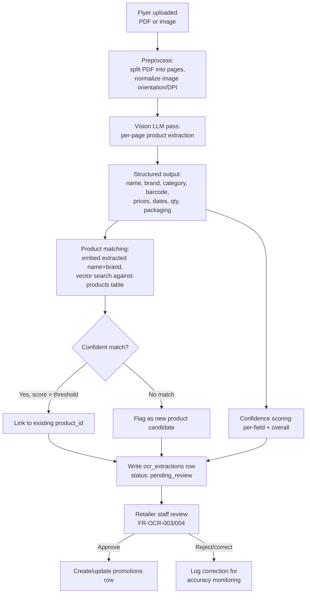
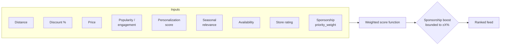
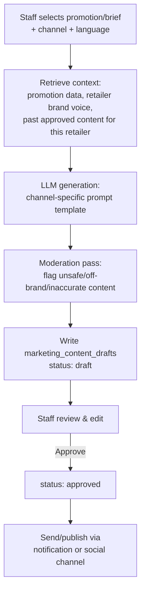
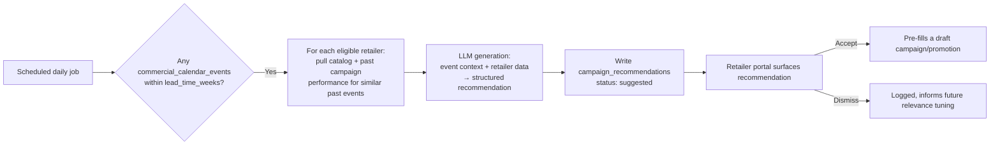

<Note>
**Phase 11** of the DealMarket Cameroon build roadmap. This is the detailed design of the AI Service Layer first introduced in [System Architecture §3.3](/product/system-architecture#3-3-ai-service-layer): the OCR pipeline, embeddings/semantic search, Smart Deal Ranking, the Recommendation Engine, the Marketing Content Generator, the Cameroon Retail Knowledge Engine, and the Competition & Insights Engine — plus the quality, safety, and cost controls that apply across all of them.
</Note>

## 1. Principles

1. **Every AI output is a proposal, never a fact, until a human or a hard rule confirms it.** OCR extractions, marketing copy, and campaign recommendations all land in a draft/pending state — this is a schema-level guarantee (Database Schema §2–6), not a UI convention.
2. **Provider-agnostic behind a thin abstraction.** All AI calls go through an internal `AIProvider` interface (generation, vision, embeddings) implemented against OpenAI today — swapping models or adding a second provider for cost/quality reasons never touches calling code.
3. **Deterministic where determinism is possible.** Ranking and basket optimization are scored/solved algorithms operating on structured data, not LLM calls — LLMs are reserved for genuinely generative or extractive tasks (OCR reading, copywriting, structured recommendation drafting).
4. **Cost and quality are monitored per feature, not just in aggregate**, so a single retailer or feature can't silently blow the AI budget or degrade unnoticed (NFR-COST-001, NFR-OPS-003).

---

## 2. Model Selection Strategy

| Capability | Model class | Used by |
|---|---|---|
| Document/vision extraction | Current-generation multimodal LLM (vision-capable) | OCR Pipeline |
| Text generation | Current-generation LLM, French + English capable | Marketing Content Generator, Retail Knowledge Engine |
| Embeddings | Compact embedding model, 1536-dim (matches `products.embedding` in Database Schema) | Product matching, semantic search, recommendations |

Model *versions* are intentionally not pinned in this document — that's a deployment/config concern (tracked in `packages/shared-types` model-config, per Folder Architecture) so upgrading a model is a config change, not an architecture change.

---

## 3. OCR Pipeline

The highest-stakes AI pipeline in the platform, because its output becomes real, consumer-facing prices (FR-OCR-001–005).

**Confidence scoring**: each extracted field (price, dates, product identity) gets an independent confidence score from the vision pass; the review UI (Folder Architecture `modules/ocr-review`) sorts and visually flags low-confidence fields first, so staff attention goes where it's actually needed rather than re-checking every field uniformly.

**Product matching**: rather than requiring an exact text match, the extracted `raw_product_name + brand_text` is embedded and matched via `pgvector` cosine similarity against `products.embedding`. Above a similarity threshold, the extraction auto-links to the canonical product (enabling price history and cross-store comparison for FR-DISC-008/009); below it, staff either confirm a suggested near-match or create a new canonical product — new products still require the same review gate.

**Accuracy feedback loop**: every staff correction (a field the model got wrong) is logged (NFR-OPS-003) and periodically reviewed to catch systematic extraction errors (e.g., a recurring misread of a specific flyer layout) — this is a monitoring signal, not an automatic retraining loop, since the platform uses a general-purpose hosted model rather than a fine-tuned one at this stage.

---

## 4. Embeddings & Semantic Search

| Use case | What's embedded | Why |
|---|---|---|
| OCR product matching (§3) | `product name + brand + category` | Links flyer extractions to canonical products despite spelling/phrasing variance |
| Semantic search fallback | Consumer search query | Catches queries that don't keyword-match but are semantically close (e.g., "cooking oil" → "huile végétale") |
| Recommendations (§6) | Consumer behavioral profile (aggregated from favorited/clicked product embeddings) | Powers "similar to what you engage with" personalization without hand-built category rules |

`pg_trgm`/`tsvector` keyword search (Database Schema §9) runs first for speed and precision; semantic search via `pgvector` is the fallback when keyword search returns few/no results, keeping the common case fast (NFR-PERF-002) while still catching the harder cases.

---

## 5. Smart Deal Ranking Service

A **deterministic scoring function**, not an LLM call — it must run within the tight latency budget in API Design §6 and be explainable/tunable, which rules out an LLM in the hot path.

**MVP weighting** (matches the Amina/Junior personas' dominant usage pattern — Phase 5): `distance`, `discount_percent`, `price`, and `popularity` (normalized recent engagement) form the base score.

**Wave 2 additions**: `personalization_score` (from the Recommendation Engine, §6), `seasonal_relevance` (boosted during an active commercial-calendar event, §7), `store_rating`, and `availability`.

**Sponsorship handling (FR-RANK-003)**: a sponsorship's `priority_weight` applies as a *bounded multiplier* on top of the organic score — capped so a highly relevant nearby organic deal can never be outranked by a distant, low-relevance sponsored one. The cap value is a tunable platform config, not hardcoded, so it can be adjusted based on observed consumer trust/engagement data without a code change.

**Cold start**: an anonymous or brand-new consumer has no personalization signal — the score function degrades gracefully to the MVP weighting subset rather than producing a broken or empty personalization term, so day-one users get a sensible feed immediately.

**Compute model**: candidate promotions are pre-filtered by geography and active-status at the database layer (using the `branches.geolocation` GiST index and the `promotions (retailer_id, status, ends_at)` composite index from Database Schema §9), then scored in-process per request — avoiding a separate batch-precomputation pipeline for MVP scale, revisited if request volume outgrows per-request scoring.

---

## 6. Recommendation Engine

| Feature | Approach |
|---|---|
| Personalized deal recommendations (FR-PERS-004) | Hybrid: content-based similarity (embedding distance between a consumer's engagement history and candidate products) blended with collaborative signals (products favorited/clicked by consumers with similar behavior) once sufficient engagement volume exists. |
| Wishlist/price-drop alerts (FR-PERS-006) | Rule-based, not ML — a straightforward comparison job watching `price_history` for a drop or promotion match against active wishlist items, dispatched via the notification pipeline. |
| Basket optimization (FR-PERS-005) | Constrained optimization: given a shopping list and candidate offers (product × store × price), find the lowest-total-cost assignment subject to a max-stores constraint (default: 2), using a greedy assignment + local-swap heuristic for MVP rather than a full solver — sufficient at typical list sizes (10–30 items) and avoids unpredictable solve times. |

The basket optimizer explicitly trades off pure cost-minimization against trip practicality (Marie persona, Phase 5: she wants one efficient trip, not the cheapest possible combination across five different stores) — the max-stores constraint is the mechanism for that trade-off, and it's user-adjustable.

---

## 7. Marketing Content Generator

- **Prompt templates are channel-specific** (a WhatsApp campaign and an Instagram caption have different length/tone/format constraints) but share a common context-retrieval step, so brand voice and promotion accuracy stay consistent across channels for the same retailer.
- **Moderation pass**: generated content is checked against a content-safety filter before it ever reaches a human reviewer, catching the rare case of an unsafe or nonsensical generation before it wastes staff time — this is in addition to, not instead of, the mandatory human approval gate (FR-MKT-003).
- **Grounding**: the prompt is always constructed with the actual `promotions` row data (price, dates, product) injected as structured context, not left to the model to recall — this is what prevents the generator from inventing a price or date that doesn't match the real promotion.

---

## 8. Cameroon Retail Knowledge Engine

- The `commercial_calendar_events.event_date_rule` (fixed date or computed, e.g. Ramadan/Easter) and `lead_time_weeks` fields (Database Schema §6) are what make this configuration-driven rather than a hardcoded "if December, suggest Christmas" branch — adding a new event, or a second country's calendar, is a data change.
- Recommendations are generated **per retailer**, grounded in that retailer's actual catalog and, where available, how similar past campaigns performed for them — a generic "run a Christmas sale" suggestion is far less useful than one referencing the retailer's own top categories and last year's results.
- Dismissal is tracked (not just discarded) so recurring low-relevance suggestion types for a given retailer can be deprioritized over time — a lightweight feedback signal, not a full learning system at MVP.

---

## 9. Competition & Insights Engine

Structural privacy constraint first, AI second (FR-COMP-002): this pipeline reads across tenants but only ever *writes* pre-aggregated rows to `competition_insights`, a table with no `retailer_id` column at all (ER Diagrams §6).

- A scheduled batch job computes metrics (`avg_price`, `engagement_index`, `trending_score`) grouped by `category_id` and `region`.
- A **minimum contributor threshold** (e.g., a bucket must include data from at least 4 distinct retailers) gates whether an aggregate is written at all — below the threshold, publishing an "average" would functionally reveal a single competitor's number, so the job withholds it for that bucket until enough contributors exist.
- Retailer-facing insight text (e.g., "your prices in this category are above the regional average") is generated from the aggregate numbers, not from any per-retailer comparison the retailer isn't authorized to see.

Customer Insights (FR-INS-001) reuses the same behavioral data (`engagement_events`) but stays within a single retailer's tenant boundary, so it carries none of the cross-tenant privacy constraints above — it's a simpler, tenant-scoped aggregation feeding "products you should promote" suggestions.

---

## 10. Quality, Safety & Cost Controls

| Concern | Control |
|---|---|
| Prompt injection (via flyer text or user content) | Extracted/user-supplied text is treated as data, never concatenated into system-level instructions; the OCR and generation prompts use structured input fields, not raw string interpolation of untrusted content into instruction context. |
| Generated content safety | Moderation pass before human review (§7); human approval gate before anything is ever sent (FR-MKT-003). |
| Extraction accuracy drift | Correction-logging feedback loop (§3); periodic sampling review of approved-without-edit extractions to catch silent accuracy decay. |
| Cost control | Every AI call tagged with `retailer_id` + feature for per-retailer, per-feature cost attribution (NFR-COST-001); subscription-tier feature limits (`subscription_plans.feature_limits`) cap usage-heavy features (e.g., marketing generations/month) at lower tiers. |
| Latency/availability | Timeouts with graceful fallback — e.g., if the Marketing Content Generator's provider call times out, the draft request fails clearly rather than hanging the review queue; ranking and basket optimization never depend on a live LLM call, so an LLM outage cannot take down core browsing. |
| Provider outage | The `AIProvider` abstraction (§1) is what makes a temporary secondary-provider failover technically possible later, without being required at MVP. |

---

## Next Phase

Phase 12: **Deployment Architecture** — environments, CI/CD pipelines, infrastructure topology (Vercel, Cloudflare, Supabase project structure), secrets management, and release strategy for both clients and the backend defined across Phases 4–11. Awaiting approval to proceed.
