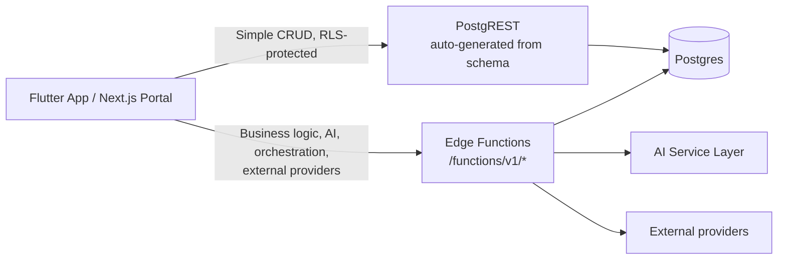

<Note>
**Phase 9** of the DealMarket Cameroon build roadmap. This defines the API surface the `infrastructure`/`data` layers from [Folder Architecture](/product/folder-architecture) implement against, operating on the [Database Schema](/product/database-schema). Authentication mechanics are detailed in Phase 10; this phase assumes a valid session and focuses on endpoints and contracts.
</Note>

## 1. Two-Tier API Strategy

Not every read/write needs custom backend code. Per the System Architecture (§3.2), the API surface has two tiers:

| Tier | Used for | Examples |
|---|---|---|
| **Direct data access** (Supabase client SDK → PostgREST, RLS-enforced) | Reads/writes that are pure CRUD against a single table or a simple filtered view, where RLS alone provides correct authorization | Browsing published promotions, managing favorites, listing a retailer's branches |
| **Edge Functions** (`/functions/v1/*`) | Anything requiring business logic, multi-table orchestration, AI calls, external providers, or side effects | OCR review approval, ranked feed generation, payment processing, marketing content generation |

Defaulting to direct data access where safe keeps the Edge Function surface focused on the parts of the system that actually need custom code — which is most of what makes this platform "AI Retail Intelligence" rather than a CRUD app.

## 2. Conventions

| Aspect | Convention |
|---|---|
| **Versioning** | All Edge Functions live under `/functions/v1/...`; a breaking contract change ships as `/v2` alongside `/v1` rather than mutating it in place (NFR-ENG-004). |
| **Auth** | `Authorization: Bearer <supabase-jwt>` on every request; anonymous access only where explicitly allowed (public feed/search per FR-AUTH-002). |
| **Response envelope** | `{ "data": ..., "error": null, "meta": { ... } }` on success; `{ "data": null, "error": { "code", "message", "details" }, "meta": null }` on failure — one shape, always. |
| **Pagination** | Cursor-based (`?cursor=...&limit=...`) for high-volume/feed-like endpoints (feed, search, analytics events); simple `?page=&per_page=` acceptable for small, bounded admin lists (branches, staff). |
| **Idempotency** | `Idempotency-Key` header required on payment-initiating and notification-dispatch endpoints — retried requests never double-charge or double-send (NFR-AVAIL-003). |
| **Rate limiting** | Enforced at the Edge Function gateway on public/unauthenticated-reachable endpoints (search, OTP, registration) per NFR-SEC-007. |
| **Errors** | Standard error codes below, always machine-parseable; human-facing message is localized (FR/EN) server-side based on request locale. |

### Standard error codes

| Code | Meaning |
|---|---|
| `UNAUTHENTICATED` | Missing/invalid session |
| `FORBIDDEN` | Authenticated but not authorized (wrong tenant, wrong role/branch scope) |
| `NOT_FOUND` | Entity doesn't exist or isn't visible to this caller |
| `VALIDATION_FAILED` | Request payload failed schema/business validation (`details` lists field errors) |
| `CONFLICT` | State conflict (e.g., sponsorship slot already booked — FR-MON-004) |
| `RATE_LIMITED` | Caller exceeded rate limit |
| `UPSTREAM_ERROR` | A dependent provider failed (payment gateway, OpenAI, Google Maps) |
| `INTERNAL_ERROR` | Unhandled server error |

---

## 3. Direct Data Access Surface

Read/write access via the Supabase client SDK, gated entirely by the RLS patterns defined in Database Schema §8.

| Client | Tables (read) | RLS pattern |
|---|---|---|
| Consumer app | `products`, `categories`, `branches`, `promotions` (`status = published`), `price_history` | Public-read |
| Consumer app | `favorites`, `wishlist_items`, `shopping_lists`, `shopping_list_items`, `store_follows`, `notification_preferences` | Consumer-owned |
| Retailer portal | `branches`, `staff_members` (own org), `flyers`, `promotions` (all statuses, own org), `coupons`, `subscriptions`, `payments` | Tenant-owned |
| Retailer portal | `products`, `categories` | Public-read |
| Platform admin | All of the above, plus `retailers.status`, `moderation_flags` | Admin-override |

Writes to consumer-owned and tenant-owned tables above go directly through the SDK where the operation is a plain insert/update/delete with no side effects beyond the row itself (e.g., adding a favorite, editing a draft promotion's price before publish). Anything with side effects (publishing a promotion, redeeming a coupon) is an Edge Function, even if it touches the same table — see §4.

---

## 4. Edge Function Endpoints

### 4.1 Retailer Onboarding & Staff

| Method & Path | Purpose | Auth | Request → Response |
|---|---|---|---|
| `POST /v1/retailers/register` | Register a new retailer org (FR-AUTH-004) | Public | `{ name, type, country_code, owner_email, owner_phone }` → `{ retailer_id, status: pending_approval }` |
| `POST /v1/retailers/{id}/staff/invite` | Invite a staff member with role + branch scope (FR-AUTH-005) | Owner | `{ email, role, branch_scope[] }` → `{ invite_id }` |
| `POST /v1/staff/accept-invite` | Accept invite, link `auth_user_id` | Public (invite-token) | `{ invite_token }` → `{ staff_member_id }` |

### 4.2 Catalog & OCR Review

| Method & Path | Purpose | Auth | Request → Response |
|---|---|---|---|
| `POST /v1/flyers/upload-url` | Get a signed Storage upload URL (FR-CAT-002) | Retailer staff (catalog_editor+) | `{ file_type }` → `{ upload_url, flyer_id }` |
| `POST /v1/flyers/{id}/reprocess` | Re-trigger OCR on a flyer (upload itself auto-enqueues via storage webhook) | Retailer staff | `{}` → `{ ocr_status }` |
| `GET /v1/flyers/{id}/extractions` | List pending extraction candidates for review (FR-OCR-003) | Retailer staff | → `{ extractions: [...] }` |
| `POST /v1/extractions/{id}/approve` | Approve (with optional field corrections) → creates/updates a `promotions` row | Retailer staff | `{ corrected_fields? }` → `{ promotion_id }` |
| `POST /v1/extractions/{id}/reject` | Reject an extraction | Retailer staff | `{ reason? }` → `{}` |
| `POST /v1/promotions/{id}/publish` | Publish an approved/manual promotion (FR-CAT-003/004) | Retailer staff | `{}` → `{ status: published }` |

### 4.3 Consumer Discovery & Ranking

| Method & Path | Purpose | Auth | Request → Response |
|---|---|---|---|
| `GET /v1/feed` | Ranked deal feed (FR-RANK-001–004) | Public/consumer | `?lat&lng&sort&category&cursor` → `{ items: [...], next_cursor }` — latency budget per NFR-PERF-003 |
| `GET /v1/search` | Keyword search across products/promotions (FR-DISC-004) | Public/consumer | `?q&lang&cursor` → `{ items: [...], next_cursor }` |
| `GET /v1/products/{id}/price-comparison` | Cross-store price comparison (FR-DISC-009) | Public/consumer | → `{ product, offers: [{retailer, branch, price}] }` |
| `GET /v1/stores/compare` | Side-by-side store comparison (FR-DISC-010) | Public/consumer | `?store_ids=a,b` → `{ stores: [...] }` |
| `POST /v1/basket/optimize` | AI shopping basket optimization (FR-PERS-005) | Consumer | `{ shopping_list_id }` → `{ optimized_plan: [{store, items, subtotal}], total_savings }` |

### 4.4 Monetization

| Method & Path | Purpose | Auth | Request → Response |
|---|---|---|---|
| `GET /v1/sponsorships/availability` | Check placement availability before purchase (FR-MON-004) | Retailer owner | `?scope&slot&dates` → `{ available, conflicting_bookings? }` |
| `POST /v1/sponsorships` | Purchase a sponsorship placement | Retailer owner | `{ scope, target_id?, starts_at, ends_at, budget }` → `{ sponsorship_id }` — returns `CONFLICT` on double-booking |
| `POST /v1/coupons` | Create a coupon campaign (FR-CAT-005) | Retailer staff | `{ code, discount_type, discount_value, max_redemptions, ...}` → `{ coupon_id }` |
| `POST /v1/coupons/{code}/redeem` | Redeem a coupon | Consumer | `{}` → `{ redemption_id, discount_applied }` |
| `POST /v1/subscriptions/checkout` | Start a subscription checkout (FR-PAY-001/004) | Retailer owner | `{ plan_id, payment_provider }` → `{ checkout_url or momo_prompt_ref }` — requires `Idempotency-Key` |
| `POST /v1/webhooks/payments/{provider}` | Provider payment callback (momo / orange / card) | Provider signature | Provider-defined payload → `{}` (200 ack) — writes to `payments`, updates `subscriptions.status` |

### 4.5 Marketing, AI & Retail Intelligence

| Method & Path | Purpose | Auth | Request → Response |
|---|---|---|---|
| `POST /v1/marketing/generate` | Generate marketing content draft (FR-MKT-001/002) | Retailer staff | `{ promotion_id?, channel, language, brief? }` → `{ draft_id, content }` — always writes `status: draft` |
| `POST /v1/marketing/drafts/{id}/approve` | Approve a draft before send/publish (FR-MKT-003) | Retailer staff | `{}` → `{ status: approved }` |
| `GET /v1/recommendations/seasonal` | List active seasonal campaign recommendations (FR-BI-004/005) | Retailer owner | → `{ recommendations: [...] }` |
| `POST /v1/recommendations/{id}/accept` \| `/dismiss` | Act on a recommendation | Retailer owner | `{}` → `{ status }` |
| `GET /v1/insights/competition` | Aggregated, anonymized competitive benchmarks (FR-COMP-001) | Retailer owner | `?category_id&region` → `{ metrics: [...] }` — never resolves to a named competitor |
| `GET /v1/insights/customer` | Behavior-driven promotion suggestions (FR-INS-001) | Retailer owner | → `{ suggested_products: [...] }` |

### 4.6 Notifications

| Method & Path | Purpose | Auth | Request → Response |
|---|---|---|---|
| `POST /v1/push-tokens` | Register a device token | Consumer/staff | `{ fcm_token, platform }` → `{}` |
| `POST /v1/notifications/campaigns` | Send a targeted push/WhatsApp campaign to followers (FR-ENG-002) | Retailer staff | `{ audience_filter, channel, content }` → `{ notification_batch_id }` — requires `Idempotency-Key` |

### 4.7 Analytics & Reporting

| Method & Path | Purpose | Auth | Request → Response |
|---|---|---|---|
| `GET /v1/analytics/dashboard` | Executive dashboard metrics (FR-DASH-001–004) | Retailer owner/analytics_viewer | `?period&branch_id?` → `{ views, clicks, shares, favorites, roi_estimate, health_score, trends }` |
| `GET /v1/analytics/reports/export` | Generate a downloadable report (FR-DASH-005) | Retailer owner | `?period&format=pdf` → `{ report_url }` (async job, polled or delivered via Realtime) |

### 4.8 Platform Admin

| Method & Path | Purpose | Auth | Request → Response |
|---|---|---|---|
| `POST /v1/admin/retailers/{id}/approve` \| `/reject` | Approve/reject retailer registration (FR-ADMIN-001) | Platform admin | `{ reason? }` → `{ status }` |
| `POST /v1/admin/moderation/{id}/resolve` | Resolve a moderation flag (FR-ADMIN-002) | Platform admin | `{ action, reason? }` → `{ status }` |
| `PUT /v1/admin/calendar-events/{id}` | Configure the commercial calendar (FR-ADMIN-004) | Platform admin | `{ name_fr, name_en, event_date_rule, lead_time_weeks }` → `{}` |

---

## 5. Realtime Channels

Supabase Realtime subscriptions, used instead of polling for live updates (System Architecture §3.2):

| Channel | Payload | Consumed by |
|---|---|---|
| `realtime:promotions:branch_id=eq.{id}` | New/updated/expired promotion | Consumer app (followed-store feed refresh) |
| `realtime:notifications:recipient_id=eq.{id}` | New notification record | Both apps (in-app notification badge) |
| `realtime:extractions:flyer_id=eq.{id}` | OCR extraction status change | Retailer portal (review queue live update) |

---

## 6. Latency Budgets

Carried directly from Non-Functional Requirements §1, so each endpoint owner knows the target it's built to:

| Endpoint class | Budget |
|---|---|
| `GET /v1/feed`, `GET /v1/search` | < 500ms p95 (NFR-PERF-002) |
| Ranking computation within feed request | < 300ms p95 (NFR-PERF-003) |
| `GET /v1/analytics/dashboard` | < 3s p95 for ≤ 12-month range (NFR-PERF-004) |
| `POST /v1/flyers/{id}/reprocess` (async OCR) | Extraction ready within 5 min (NFR-PERF-005) |

---

## Next Phase

Phase 10: **Authentication Strategy** — the concrete mechanics behind the `Authorization: Bearer` assumption used throughout this document: OTP flow, session/JWT handling, role/branch-scope enforcement, and the invite-acceptance flow referenced in §4.1. Awaiting approval to proceed.
