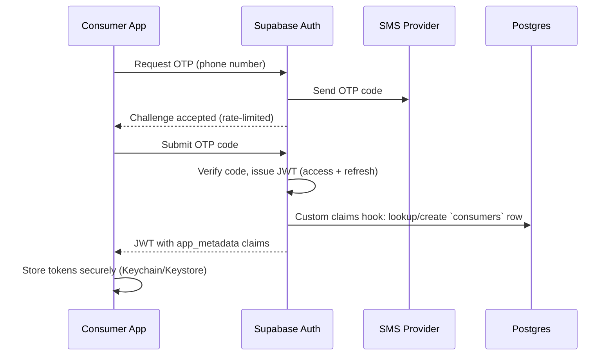
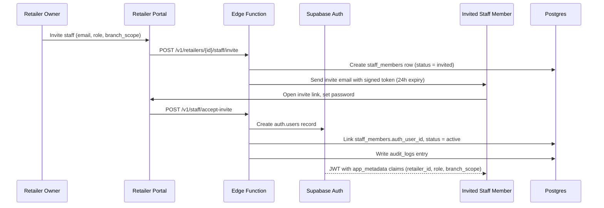

<Note>
**Phase 10** of the DealMarket Cameroon build roadmap. This defines the mechanics behind every `Authorization: Bearer` call assumed in [API Design](/product/api-design), and how identity ties into the RLS policies from [Database Schema §8](/product/database-schema#8-row-level-security-approach).
</Note>

## 1. Principles

1. **Supabase Auth is the identity system of record.** `auth.users` holds credentials; every other actor table (`consumers`, `staff_members`, `platform_admins`) is a 1:1 profile extension keyed on `auth_user_id`, never a parallel credential store.
2. **Authorization travels in the JWT, not in extra round-trips.** Role, tenant, and branch scope are embedded as custom claims at token-issuance time so RLS policies read them directly from `auth.jwt()` instead of joining `staff_members` on every query — a direct consequence of the NFR-PERF-002/003 latency budgets.
3. **Different actors, different rigor.** Consumers get frictionless OTP/social sign-in; retailer staff get invite-gated accounts; platform admins get the strictest controls (mandatory MFA). One system, three trust levels.
4. **Every auth-relevant change is audited and, where it affects authorization, invalidates existing sessions.** A deactivated staff member's existing token cannot keep working until it happens to expire (FR-AUTH-006, NFR-SEC-004).

---

## 2. Identity Providers by Actor

| Actor | Sign-in methods | Notes |
|---|---|---|
| Consumer | Phone + OTP (primary), email/password, Google, Apple | Apple Sign-In is included specifically because iOS requires it when any other social sign-in option is offered; Facebook considered Wave 2 given its popularity in-market. |
| Retailer Owner | Email/password | Created at registration (FR-AUTH-004); MFA strongly recommended, enforced for Enterprise-tier accounts. |
| Retailer Staff | Email/password, activated via invite token | Never self-registers — always created by an Owner invite (FR-AUTH-005). |
| Platform Admin | Email/password + mandatory MFA (TOTP) | Highest-privilege actor; no exceptions on MFA (NFR-SEC-003). |

---

## 3. Consumer Authentication Flow



- Browsing (FR-AUTH-002) requires no auth at all — the OTP/social flow above only triggers when the consumer takes an action that needs an account (favoriting, following a store, checkout of premium membership).
- Social sign-in (Google/Apple) follows Supabase's standard OAuth flow; the same custom-claims hook fires regardless of provider, so downstream authorization logic never branches on sign-in method.
- Resend cooldown (60s) and a per-phone-number daily OTP request cap are enforced at the Edge Function gateway (NFR-SEC-007), independent of whatever default limits Supabase Auth provides.

---

## 4. Retailer Staff Authentication & Invite Flow



- Invite tokens are single-use and expire after 24 hours; an expired/used token returns `VALIDATION_FAILED`, and the Owner can resend.
- A staff member's `status` gates login independent of their Supabase Auth credential validity — `deactivated` staff cannot obtain a usable session even with a correct password, checked at the custom-claims hook (§7).

---

## 5. Platform Admin Authentication

Platform Admins use email/password plus **mandatory TOTP-based MFA** — no admin session is issued without a second factor, reflecting the breadth of cross-tenant access this role carries (System Architecture §5, admin-override RLS pattern). Admin accounts are provisioned manually by existing Super Admins, never self-registered or invite-linked through the retailer flow.

---

## 6. Session & Token Management

| Aspect | Approach |
|---|---|
| Access token lifetime | 1 hour |
| Refresh token | Rotated on each use; long-lived but revocable |
| Storage (mobile) | Secure platform storage (iOS Keychain / Android Keystore), never plain local storage |
| Storage (web) | HttpOnly, Secure, SameSite cookies for the refresh token; access token held in memory only |
| Logout | Revokes the refresh token server-side, not just a client-side token discard |
| Forced revocation | Triggered on: staff deactivation, role/branch_scope change, password reset, suspected compromise — invalidates all outstanding refresh tokens for that `auth_user_id` |

The 1-hour access token lifetime is the deliberate bound on claim staleness: a role or branch-scope change takes effect for a given session within, at most, one hour even without an explicit forced revocation, and forced revocation (above) closes that gap immediately for security-sensitive changes like deactivation.

---

## 7. Custom Claims & RLS Integration

A Postgres function registered as Supabase's **Custom Access Token Hook** runs at token issuance/refresh and injects authorization data directly into the JWT's `app_metadata`, so RLS policies never need a join back to `staff_members` or `consumers` on every request:

```json
{
  "sub": "<auth_user_id>",
  "role": "authenticated",
  "app_metadata": {
    "actor_type": "staff_member",
    "retailer_id": "b3f...",
    "staff_role": "catalog_editor",
    "branch_scope": ["a1c...", "9de..."],
    "staff_status": "active"
  }
}
```

For a consumer session, the equivalent shape is:

```json
{
  "sub": "<auth_user_id>",
  "role": "authenticated",
  "app_metadata": {
    "actor_type": "consumer",
    "consumer_id": "77e...",
    "membership_tier": "free"
  }
}
```

This is what the "tenant-owned" RLS pattern (Database Schema §8) actually evaluates against — e.g., a `promotions` policy reads:

```sql
retailer_id = (auth.jwt() -> 'app_metadata' ->> 'retailer_id')::uuid
```

instead of a subquery against `staff_members`, which is both faster (no extra join per row-check, supporting NFR-PERF budgets) and keeps the policy simple enough to audit at a glance (NFR-SEC-005).

---

## 8. Role & Branch-Scope Enforcement

| Layer | Enforcement |
|---|---|
| **Database (RLS)** | `retailer_id` claim scopes every tenant-owned table read/write; `branch_scope` claim, when non-null, further restricts `promotions`/`flyers` policies to `branch_id = ANY(branch_scope)` — this is how the Brice persona (branch-limited Retailer Staff) is structurally prevented from touching another branch's data, not just hidden from it in the UI. |
| **Edge Functions** | Every function re-validates `staff_role` against the specific action's minimum required role (e.g., `POST /v1/sponsorships` requires `owner`) before executing — defense in depth on top of RLS, per NFR-SEC-003. |
| **Client UI** | Role/branch-scope also drives what's rendered (an `analytics_viewer` never sees a "Create Campaign" button) — a UX convenience only, never the actual security boundary. |

---

## 9. Security Controls

| Control | Detail |
|---|---|
| Rate limiting | OTP requests, login attempts, and registration are rate-limited per phone/email/IP at the Edge Function gateway (NFR-SEC-007). |
| Account lockout | 5 consecutive failed password attempts triggers a 15-minute lockout with notification to the account owner. |
| Password policy | Minimum 10 characters for staff/admin accounts, checked against a common-password blocklist; consumers using email/password follow the same minimum. |
| MFA | Mandatory for Platform Admins; strongly recommended (and enforced for Enterprise tier) for Retailer Owners; not applicable to OTP/social consumer sign-in, which has its own out-of-band verification. |
| Audit logging | Every login, role change, invite, deactivation, and forced revocation writes to `audit_logs` (FR-AUTH-006, NFR-SEC-004). |
| Cross-tenant test coverage | Automated tests attempt authenticated cross-tenant reads/writes on every tenant-owned table as part of CI, asserting RLS denies them (NFR-SEC-008, tying back to Folder Architecture's `supabase/tests/`). |

---

## 10. Account Lifecycle

- **Consumer deletion/export (FR-AUTH-007)**: a consumer-initiated deletion request soft-deletes the `consumers` profile and schedules hard deletion of PII after the retention window (NFR-PRIV-001); an export request packages the consumer's own data (favorites, lists, order/engagement history) and is delivered within a defined SLA.
- **Staff offboarding**: an Owner deactivating a staff member immediately sets `status = deactivated` and triggers forced session revocation (§6) — no separate manual "log them out" step exists, so offboarding cannot be accidentally incomplete.
- **Retailer suspension**: Platform Admin suspending a retailer (`retailers.status = suspended`) cascades to block all of that retailer's staff sessions from performing tenant-owned writes, enforced at the RLS layer by including `retailer.status = 'active'` in the tenant-owned write policies, not only checked at the application layer.

---

## Next Phase

Phase 11: **AI Architecture** — internals of the AI Service Layer introduced in System Architecture §3.3: model choices, the OCR pipeline design, embedding/ranking strategy, prompt/pipeline design for the Marketing Assistant and Retail Knowledge Engine, and cost/quality controls. Awaiting approval to proceed.
