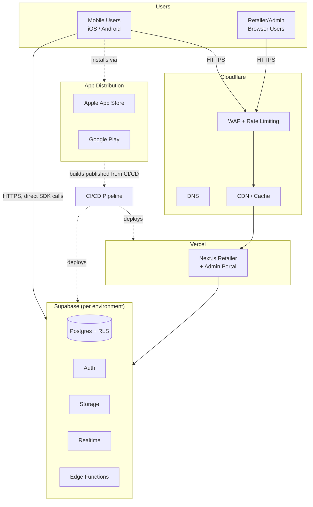
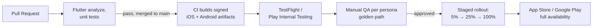
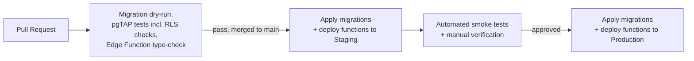

<Note>
**Phase 12** of the DealMarket Cameroon build roadmap. This defines how everything designed in Phases 4–11 actually ships: environments, infrastructure topology, CI/CD pipelines, secrets management, and rollback strategy for the Flutter app, the Next.js platform, and the Supabase backend.
</Note>

## 1. Environments

| Environment | Purpose | Supabase project | Web hosting | Mobile distribution |
|---|---|---|---|---|
| **Development** | Active feature work, ephemeral | Shared dev project (or local Supabase via CLI, per MCP server instructions) | Vercel preview deployments per PR | Local builds + internal simulators |
| **Staging** | Pre-production validation, mirrors prod config | Dedicated staging project | Vercel staging deployment (fixed URL) | TestFlight (iOS) / Play Internal Testing (Android) |
| **Production** | Live traffic | Dedicated production project | Vercel production deployment | App Store / Google Play |

Three separate Supabase projects (not schemas within one project) for dev/staging/production — this gives full isolation of data, RLS policies, and Edge Function config per environment, so a staging migration or a bad test promotion can never touch production data (reinforces NFR-SEC-008 at the infrastructure level, not just the schema level).

---

## 2. Infrastructure Topology

Cloudflare sits in front of both the Next.js portal and, via DNS, the Supabase project's custom domain — giving CDN caching for static/portal assets and a WAF/rate-limiting layer ahead of the API surface, ahead of (in addition to, not instead of) the Edge Function-level rate limiting from API Design §2.

---

## 3. CI/CD Pipelines

Extending the CI trigger boundaries from Folder Architecture §6 into full CI/CD:

### 3.1 Web (`apps/web`)

```mermaid
flowchart LR
    PR[Pull Request] --> CI1[Lint, type-check,<br/>unit tests, Playwright e2e]
    CI1 -->|pass| Preview[Vercel preview deploy]
    Preview --> Review[Code review]
    Review -->|approved & merged to main| CI2[Re-run full CI on main]
    CI2 -->|pass| StagingDeploy[Auto-deploy to Staging]
    StagingDeploy --> Manual[Manual promotion approval]
    Manual --> ProdDeploy[Deploy to Production<br/>Vercel atomic deployment]
```

Vercel's atomic, immutable deployments mean production deploys are inherently zero-downtime (NFR-OPS-004) — a new deployment is fully built and healthy before traffic cuts over, and the previous deployment stays available for instant rollback (§6).

### 3.2 Mobile (`apps/mobile`)

Mobile releases are inherently slower than web (app store review time, phased rollout) — this is a deliberate constraint the release cadence (Phase 16) must plan around, not something CI/CD can shortcut. Staged rollout percentages are monitored against crash rate and core funnel metrics before advancing to the next tranche.

### 3.3 Backend (`supabase/`)

Migrations follow an **expand-contract pattern**: additive changes (new tables/columns) deploy ahead of and independently from the application code that uses them; destructive changes (dropping a column) only ship after the application code that depended on it is fully rolled out and confirmed — so a mobile app still in staged rollout on an older build never breaks against a newer database schema.

---

## 4. Secrets Management

| Secret class | Storage | Rotation |
|---|---|---|
| Supabase service role / DB credentials | Supabase project settings, injected into CI via GitHub Actions encrypted secrets — never committed, never in client bundles | Rotated on suspected exposure; access reviewed quarterly |
| OpenAI / Google Maps / FCM / payment provider API keys | Environment-scoped secrets (separate values per dev/staging/prod) in Vercel and Supabase Edge Function secrets | Rotated on schedule per provider recommendation, immediately on suspected exposure |
| Mobile signing keys (iOS certificates, Android keystore) | Secure CI secret storage (e.g., GitHub Actions encrypted secrets or a dedicated signing service) | Access restricted to the release pipeline only, never checked into the repo |
| Webhook signing secrets (payment providers) | Edge Function environment secrets, verified on every incoming webhook before processing | Rotated per provider policy |

No secret is ever environment-shared — a staging key compromise cannot expose production, consistent with the environment isolation in §1.

---

## 5. Observability in Production

Implementing the Non-Functional Requirements §9 observability requirements concretely:

| Signal | Tool/approach |
|---|---|
| Error tracking (both clients + Edge Functions) | Centralized error tracking (e.g., Sentry) with environment tagging, so staging noise never pages on-call for production |
| Structured logs | Supabase Edge Function logs + Vercel logs, aggregated to a central log sink |
| Uptime/synthetic checks | External uptime monitor hitting `/v1/feed` and the portal login page from outside the infrastructure, independent of internal health checks |
| Alerting | Payment failures, OCR pipeline stalls, and notification delivery failures page on-call directly (NFR-OPS-002); other anomalies route to a monitoring dashboard reviewed daily |
| AI-specific monitoring | Per-feature cost and latency dashboards (NFR-COST-001); OCR correction-rate trend (AI Architecture §3) reviewed weekly as a quality signal |

---

## 6. Rollback Strategy

| Layer | Rollback mechanism |
|---|---|
| Web (Next.js/Vercel) | Instant rollback to the previous immutable deployment via Vercel — no rebuild required. |
| Backend logic (Edge Functions) | Redeploy the previous function version; because functions are versioned artifacts, this is equivalent to the web rollback in speed. |
| Database (migrations) | Expand-contract (§3.3) means most changes don't need a "down" migration in an emergency — the additive step can simply be left in place while the application-level rollback happens; genuinely destructive migrations require a tested down-migration before they're allowed to ship. |
| Mobile (App Store/Play) | Cannot be rolled back instantly — mitigated by (a) staged rollout halting immediately on a bad signal, (b) a remote feature-flag kill-switch for any risky new feature so it can be disabled without a new binary, and (c) an expedited-review path reserved for critical fixes. |

The mobile rollback gap is the reason the feature-flag mechanism from Folder Architecture/API Design isn't optional polish — it's the primary tool for de-risking a mobile release given app stores don't support instant rollback.

---

## 7. Multi-Country Expansion Note

Per the expansion strategy (System Architecture §7, NFR-SCALE-005), a new country is a **configuration deployment**, not new infrastructure: the same Supabase projects, Vercel deployment, and mobile binary serve multiple countries via `retailers.country_code`-driven config (currency, language, calendar, payment providers). Dedicated per-country infrastructure is only revisited if a future market's data residency law requires it — not a default assumption.

---

## Next Phase

Phase 13: **UI/UX Wireframes** — screen-level flows for the consumer app and retailer portal, grounded in the personas (Phase 5) and functional requirements (Phase 2), informing the Component Library in Phase 14. Awaiting approval to proceed.
