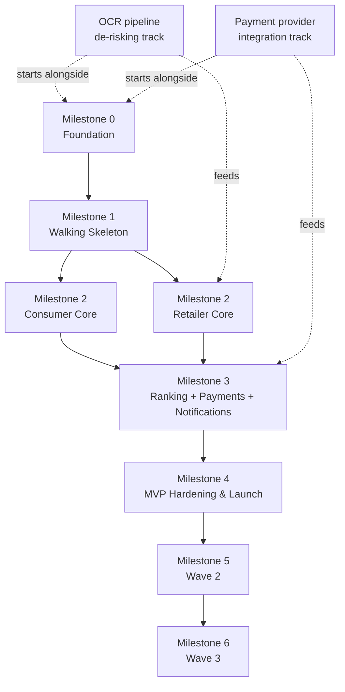

<Note>
**Phase 15** of the DealMarket Cameroon build roadmap. This sequences the MVP/Wave 1–3 scope from the [PRD §11](/product/requirements#11-mvp-scope-vs-later-phases) into a concrete build order across everything defined in Phases 4–14. Week ranges are **illustrative planning assumptions**, not commitments — Phase 16 (Sprint Planning) breaks Milestones 0–2 into real sprints with actual team velocity.
</Note>

## 1. Sequencing Principles

1. **Walking skeleton before feature breadth.** The first thing built end-to-end is the thinnest possible slice touching every architectural layer (retailer creates a promotion → it's published → the consumer app displays it) — this validates the Phase 4–12 architecture actually works together before investing in any single feature's full depth.
2. **Vertical slices, not horizontal layers.** Each milestone ships a usable capability across all layers (schema → API → UI) for a bounded scope, rather than "finish all schemas, then all APIs, then all UI" — the latter delays any real validation until everything is theoretically done at once.
3. **Sequence by dependency, not by PRD section order.** Authentication and the design system block nearly everything else and come first regardless of feature priority; Smart Ranking's advanced weighting can trail basic browsing since the ranking service degrades gracefully (AI Architecture §5).
4. **De-risk the highest-uncertainty work earliest.** OCR accuracy against real Cameroonian flyers and MTN/Orange Money integration are the two components with the most external unknowns (Product Requirements §14) — both start in parallel tracks well before they're needed for a full release, not bolted on at the end.

---

## 2. Dependency Graph

OCR and payment integration run as **parallel de-risking tracks** starting at Milestone 0, not sequential steps — both involve external dependencies (real flyer samples from pilot retailers, MTN/Orange sandbox access and compliance) whose lead time is outside engineering's control, so starting late would block the milestones that need them.

---

## 3. Milestones

### Milestone 0 — Foundation

*Everything downstream depends on this; nothing user-facing ships yet.*

- Monorepo scaffold (Folder Architecture), CI/CD skeleton (Deployment Architecture §3) for all three CI paths
- Three Supabase environments provisioned; core tenancy + catalog + consumer schema migrations (Database Schema §2–4) applied to dev
- Authentication mechanics live: OTP flow, staff invite flow, custom-claims hook, base RLS policies (Authentication Strategy)
- Design tokens v1 published to `packages/design-tokens`; base component set started (Button, TextField, Card, Nav shells)
- OCR de-risking track starts: test extraction quality against real flyer samples from prospective pilot retailers
- Payment integration track starts: MTN MoMo + Orange Money sandbox access, compliance/KYC process initiated

### Milestone 1 — Walking Skeleton

*Proves the architecture end-to-end with the narrowest possible scope.*

- A Retailer Owner can register, get approved, create one manual promotion, and publish it
- A consumer can open the app and see that promotion in an unranked, unstyled feed
- Full round-trip through Postgres/RLS, Edge Functions, both clients, and CI/CD to staging — validates Phases 4–12 actually compose, before any feature-depth work begins

### Milestone 2 — MVP Core (Consumer + Retailer, parallel tracks)

<Tabs>
  <Tab title="Consumer Core">
    - Deal discovery: feed, sort/filter, categories, Deal of the Day, Flash Deals, countdown (FR-DISC-001–007)
    - Search (keyword only — semantic fallback is Wave-adjacent, tracked separately)
    - Favorites, wishlist, shopping list, store follow (FR-PERS-001–003)
    - Map, directions, store profiles (FR-LOC-001–003)
    - Sharing to WhatsApp/social (FR-NOTIF-002)
    - FR/EN, dark mode, offline caching, onboarding (FR-UX-001–004)
  </Tab>
  <Tab title="Retailer Core">
    - Branch management, staff invite/roles (FR-CAT-001, FR-AUTH-005, FR-OPS-001–003)
    - Manual promotion CRUD + scheduling (FR-CAT-003–004)
    - AI OCR upload → review → publish flow, production-quality by this point (FR-OCR-001–004)
    - Basic analytics: views/clicks/favorites (FR-DASH-001)
  </Tab>
</Tabs>

These two tracks run in parallel by different squads (§4) since they share the schema/API/design-system foundation from Milestones 0–1 but touch almost entirely different screens.

### Milestone 3 — Ranking, Payments, Notifications

- Smart Deal Ranking service live with MVP weighting (distance, discount, price, popularity) (FR-RANK-001, FR-RANK-003–004)
- MTN Mobile Money + Orange Money billing live for retailer subscriptions (FR-PAY-001–002, FR-PAY-004–005)
- Push notifications: followed-store updates, flash deals, basic geo-targeting (FR-NOTIF-001, FR-NOTIF-004)
- Platform Admin: retailer approval queue, basic moderation (FR-ADMIN-001–002)

### Milestone 4 — MVP Hardening & Launch

- Security review against the OWASP-aligned checklist and cross-tenant RLS test suite (NFR-SEC-005, NFR-SEC-008)
- Load testing against the NFR-SCALE-002 targets; performance tuning against NFR-PERF budgets
- Closed beta with 3–5 pilot retailers across Douala and Yaoundé — real flyers, real transactions, real consumer feedback before public launch
- Staged mobile rollout (Deployment Architecture §3.2) to public availability

### Milestone 5 — Wave 2

- Sponsorship system (products/categories/stores/banners), coupons (FR-MON-001–004, FR-CAT-005)
- AI Marketing Assistant, Cameroon Retail Knowledge Engine (FR-MKT-001–003, FR-BI-004–006)
- Expanded BI dashboard (ROI, health score, forecasts, export) (FR-DASH-002–005)
- Personalized recommendations, basket optimization, wishlist alerts (FR-PERS-004–006)
- Premium consumer membership, referral program (FR-PAY-006)
- Semantic search fallback (AI Architecture §4)

### Milestone 6 — Wave 3

- AI Competition Analysis, Customer Insights (FR-COMP-001–002, FR-INS-001)
- Distributor/manufacturer advertising portal, brand entity (Database Schema §2, Wave 3 persona)
- Visa/Mastercard billing, Enterprise tier (FR-PAY-003)
- WhatsApp notification channel
- First multi-country expansion: validate config-driven country/currency/language/calendar approach (System Architecture §7) against a real second market

---

## 4. Team Shape Assumption

A rough cross-functional squad structure this sequencing assumes — refined into actual staffing in Sprint Planning:

| Squad | Focus | Active from |
|---|---|---|
| Platform/Backend | Schema, Edge Functions, RLS, payments/webhooks | Milestone 0 |
| AI/ML | OCR pipeline, ranking, recommendations, generation | Milestone 0 (de-risking), full-time from Milestone 2 |
| Mobile | Flutter consumer app | Milestone 1 |
| Web | Next.js retailer portal + admin | Milestone 1 |
| Design | Design system (Phase 14) + ongoing screen design | Milestone 0, ahead of the squad that consumes each screen |
| QA/DevOps | CI/CD, test infrastructure, security/load testing | Milestone 0, ramping at Milestone 4 |

Design intentionally runs **ahead** of Mobile/Web on each milestone's screens, not in parallel with implementation — a screen shouldn't be built against wireframes alone when the actual component-library styling is about to land days later.

---

## 5. Illustrative Timeline

| Milestone | Duration (illustrative) | Cumulative |
|---|---|---|
| 0 — Foundation | 3–4 weeks | Week 4 |
| 1 — Walking Skeleton | 1–2 weeks | Week 6 |
| 2 — MVP Core (parallel) | 6–8 weeks | Week 14 |
| 3 — Ranking/Payments/Notifications | 3–4 weeks | Week 18 |
| 4 — Hardening & Launch | 3–5 weeks (incl. beta) | Week 23 |
| 5 — Wave 2 | 8–10 weeks | Week 33 |
| 6 — Wave 3 | 8–10 weeks | Week 43 |

**MVP public launch lands around Week 23** on this assumption set — roughly 5–6 months from a standing start, dominated by Milestones 0–2 since they carry the walking-skeleton and de-risking work everything else depends on.

---

## 6. Definition of Done Per Milestone

| Milestone | Exit criteria |
|---|---|
| 0 | CI green on all three pipelines; auth flow works end-to-end in staging; design tokens consumed by at least one real component in each app |
| 1 | A promotion created in the retailer portal is visible, unranked, in the consumer app — verified in staging, not just locally |
| 2 | All listed FRs demoable per persona golden path (Phase 5); OCR extraction accuracy meets an agreed threshold on real pilot-retailer flyers |
| 3 | A real MTN/Orange transaction completes end-to-end in sandbox; ranked feed meets the NFR-PERF-003 latency budget under test load |
| 4 | Security review passed with no unresolved high-severity findings; load test meets NFR-SCALE-002; closed beta feedback triaged and blocking issues resolved |
| 5 / 6 | Feature-level FRs demoable; no regression against MVP NFR budgets; Wave 3's multi-country validation confirms no hardcoded Cameroon-only assumption blocks a second market |

---

## Next Phase

Phase 16: **Sprint Planning** — breaking Milestones 0 through 2 (the path to Walking Skeleton and MVP Core) into concrete sprints with specific tickets, ahead of Phase 17's feature-by-feature build. Awaiting approval to proceed.
