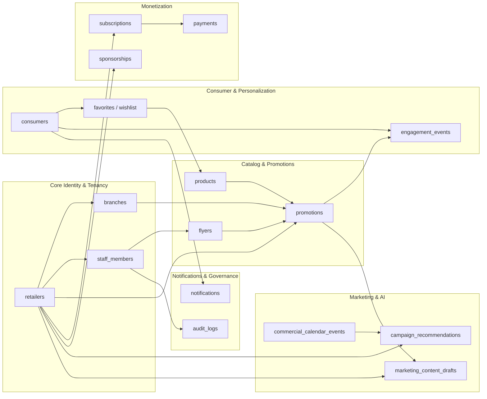
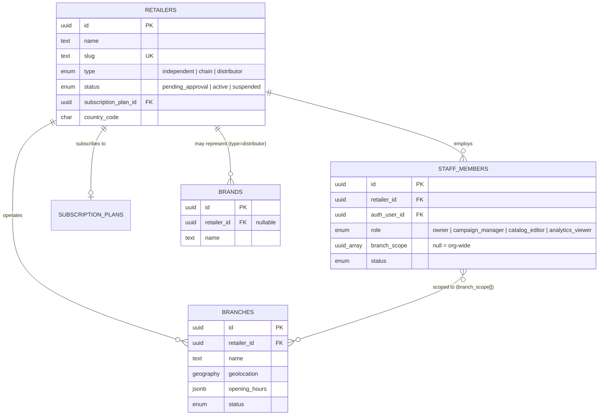
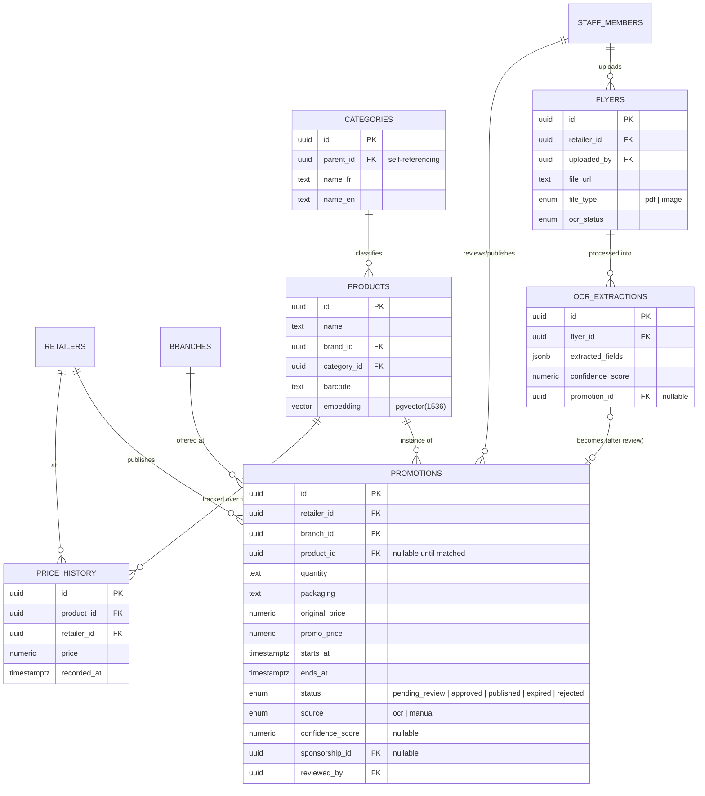
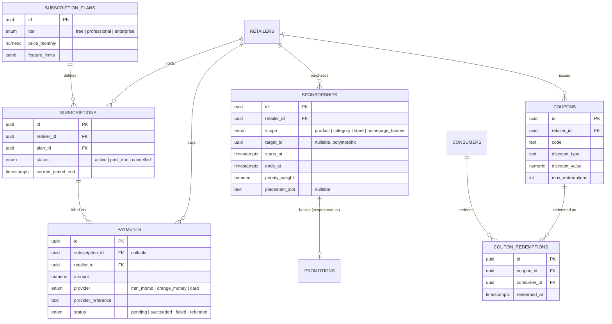
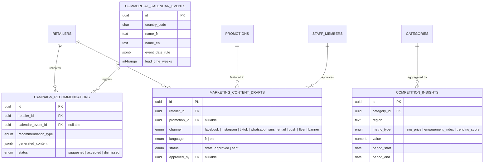
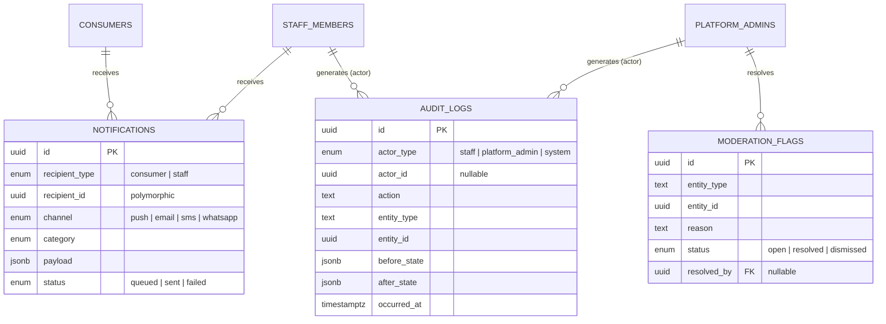

<Note>
**Phase 7** of the DealMarket Cameroon build roadmap. These diagrams visualize the schema defined in [Database Schema](/product/database-schema), split by domain for readability. Each diagram shows key attributes only (primary/foreign keys and the columns most relevant to understanding the relationship) — the full column list and types live in Phase 6, not here.
</Note>

## 1. Domain Overview

How the six schema domains relate to one another. Arrows cross domain boundaries via the tenant (`retailers`) and consumer (`consumers`) anchors.



---

## 2. Core Identity & Tenancy



**Reading this diagram**: `staff_members.branch_scope` is not a foreign key column in the strict relational sense (it's a nullable UUID array) — it's shown as a many-to-many relationship to `BRANCHES` because that's its functional effect: a null value scopes a staff member to the whole retailer (Estelle persona), while a populated array scopes them to specific branches only (Brice persona).

---

## 3. Catalog & Promotions



**Reading this diagram**: `OCR_EXTRACTIONS |o--o| PROMOTIONS` is intentionally optional-to-optional — an extraction exists before any promotion is created, and only links to one once a staff member approves it (FR-OCR-003). This is the schema-level enforcement of the human-verification gate from the System Architecture's OCR pipeline flow.

---

## 4. Consumer & Personalization

```mermaid
erDiagram
    CONSUMERS ||--o{ FAVORITES : "saves"
    CONSUMERS ||--o{ WISHLIST_ITEMS : "saves"
    CONSUMERS ||--o{ SHOPPING_LISTS : "creates"
    SHOPPING_LISTS ||--o{ SHOPPING_LIST_ITEMS : "contains"
    CONSUMERS ||--o{ STORE_FOLLOWS : "follows"
    RETAILERS ||--o{ STORE_FOLLOWS : "followed by"
    CONSUMERS ||--o{ ENGAGEMENT_EVENTS : "generates"
    PROMOTIONS ||--o{ ENGAGEMENT_EVENTS : "target of"
    PRODUCTS ||--o{ FAVORITES : "favorited"
    PRODUCTS ||--o{ WISHLIST_ITEMS : "wishlisted"
    PRODUCTS ||--o{ SHOPPING_LIST_ITEMS : "listed"
    CONSUMERS ||--o{ PUSH_TOKENS : "registers"
    CONSUMERS ||--|| NOTIFICATION_PREFERENCES : "configures"

    CONSUMERS {
        uuid id PK
        uuid auth_user_id FK
        text display_name
        enum preferred_language
        geography home_location "nullable, consented"
        enum membership_tier "free | premium"
        uuid referred_by FK "nullable"
    }
    ENGAGEMENT_EVENTS {
        uuid id PK
        uuid consumer_id FK "nullable, anon browsing"
        enum event_type "view | click | share | search | favorite | impression"
        uuid promotion_id FK "nullable"
        uuid product_id FK "nullable"
        uuid retailer_id FK "denormalized"
        text search_query "nullable"
        timestamptz occurred_at
    }
    SHOPPING_LISTS {
        uuid id PK
        uuid consumer_id FK
        text name
    }
    SHOPPING_LIST_ITEMS {
        uuid id PK
        uuid shopping_list_id FK
        uuid product_id FK "nullable"
        text free_text_item "nullable"
        int quantity
        boolean checked
    }
    STORE_FOLLOWS {
        uuid consumer_id FK
        uuid retailer_id FK
    }
    PUSH_TOKENS {
        uuid id PK
        uuid consumer_id FK "nullable"
        uuid staff_member_id FK "nullable"
        text fcm_token
        text platform
    }
    NOTIFICATION_PREFERENCES {
        uuid consumer_id PK_FK
        boolean flash_deals
        boolean wishlist_alerts
        boolean followed_store_updates
        boolean seasonal_reminders
    }
```

**Reading this diagram**: `ENGAGEMENT_EVENTS.consumer_id` is nullable because anonymous browsing (FR-AUTH-002) must still be tracked for aggregate ranking/trending signals (FR-RANK-001) even without an account — this table is the busiest in the system and is partitioned monthly per the Phase 6 indexing notes.

---

## 5. Monetization



---

## 6. Marketing, AI & Retail Intelligence



**Reading this diagram**: `COMPETITION_INSIGHTS` deliberately has **no `retailer_id` column** and no relationship to any single `RETAILERS` row — it only aggregates by `category_id` and `region`. This is the schema-level guarantee behind FR-COMP-002 (no retailer ever sees another retailer's raw data): the table structurally cannot carry a per-retailer identity back to consumers of this data.

---

## 7. Notifications & Governance



---

## 8. Cross-Domain Relationship Summary

Foreign keys that connect entities across the diagrams above, for quick reference when a change in one domain might ripple into another:

| Source | Target | Relationship |
|---|---|---|
| `promotions.sponsorship_id` | `sponsorships.id` | A published promotion may be boosted by an active sponsorship (Catalog ↔ Monetization) |
| `engagement_events.promotion_id` | `promotions.id` | Every ranking/BI signal traces back to a specific deal (Consumer ↔ Catalog) |
| `campaign_recommendations.retailer_id` | `retailers.id` | Seasonal recommendations are always retailer-scoped, even though the calendar itself is not (Marketing/AI ↔ Tenancy) |
| `marketing_content_drafts.promotion_id` | `promotions.id` | Generated marketing copy is often anchored to a specific deal (Marketing/AI ↔ Catalog) |
| `push_tokens.consumer_id` / `push_tokens.staff_member_id` | `consumers.id` / `staff_members.id` | One token table serves both client apps, disambiguated by which FK is populated (Notifications ↔ Consumer & Tenancy) |
| `audit_logs.actor_id` | `staff_members.id` or `platform_admins.id` | Polymorphic actor reference, resolved via `actor_type` (Governance ↔ Tenancy) |

---

## Next Phase

Phase 8: **Folder Architecture** — the concrete repository/project structure for the Flutter app and Next.js platform (Clean Architecture layers, feature-based modules) that this schema and the API design in Phase 9 will be implemented against. Awaiting approval to proceed.
