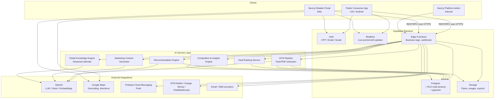
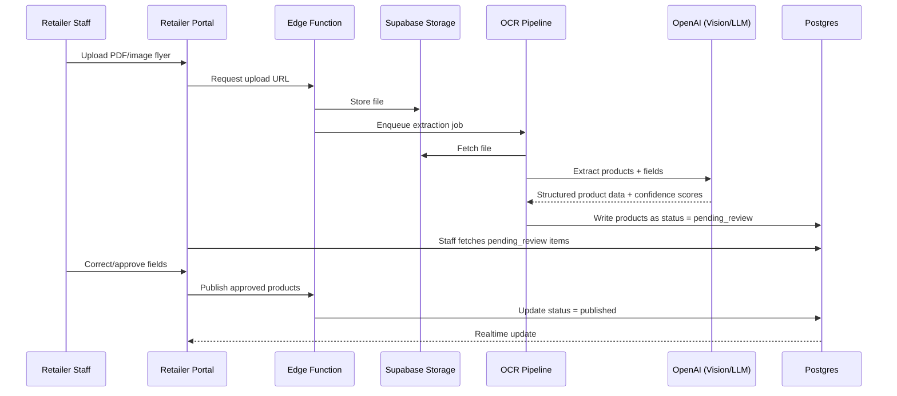
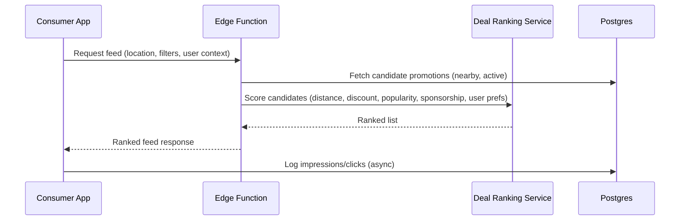
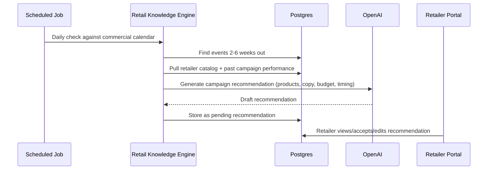

<Note>
**Phase 4** of the DealMarket Cameroon build roadmap. This document sets the high-level architecture that later phases drill into: [Database Schema](#) (Phase 6), API Design (Phase 9), Authentication Strategy (Phase 10), AI Architecture (Phase 11), and Deployment Architecture (Phase 12) each expand a piece of what's outlined here — this page is the map, not the detail.
</Note>

## 1. Architectural Principles

1. **API-first, shared backend.** The Flutter consumer app and Next.js retailer portal are two independent clients of one backend and one data model — a promotion published once is immediately visible everywhere it should be.
2. **Multi-tenant by construction.** Every retailer organization's data is isolated at the database layer (row-level security keyed on `retailer_id`), not only in application code, per NFR-SCALE-004 / NFR-SEC-008.
3. **AI as a service layer, not a special case.** OCR, ranking, recommendations, and content generation are backend services behind stable contracts — swappable and independently scalable, never embedded directly in client code.
4. **Human-in-the-loop by default.** Every AI pipeline that produces consumer-facing or price-bearing output writes to a "pending review" state first; nothing AI-generated auto-publishes (FR-OCR-003, FR-MKT-003).
5. **Config over code for expansion.** Country, language, currency, payment providers, and the commercial calendar are data, not code — enforced by keeping this logic out of client and business-logic layers and inside configuration tables (NFR-SCALE-005).
6. **Everything asynchronous that can be.** Flyer OCR, notification fan-out, and report generation run as queued background jobs so they never block a request-response path (NFR-SCALE-003).

---

## 2. High-Level Component Diagram

---

## 3. Component Breakdown

### 3.1 Clients

| Component | Stack | Responsibility |
|---|---|---|
| Consumer Mobile App | Flutter (iOS/Android) | Deal discovery, personalization, maps, sharing, notifications — per Functional Requirements §3–7 |
| Retailer Web Portal | Next.js | Catalog, promotions, monetization tools, campaigns, analytics — per Functional Requirements §8–11, §17 |
| Platform Admin Console | Next.js (internal, role-gated) | Retailer approval, content moderation, platform-wide analytics, commercial calendar config — per Functional Requirements §19 |

Both consumer and retailer clients talk to the **same backend API surface**; the admin console is a permissioned view over the same data model, not a separate system.

### 3.2 Backend (Supabase)

| Component | Responsibility |
|---|---|
| **Postgres** | System of record. Row-Level Security enforces tenant isolation and role-based access at the query layer, not just in application code. `pgvector` extension stores embeddings for semantic search and recommendations. |
| **Auth** | OTP (phone), email/password, and social sign-in for consumers; email/password + invitation flow for retailer staff; issues JWTs consumed by RLS policies. |
| **Storage** | Flyer PDFs, product images, generated flyers/banners, exported reports — tiered by access level (public deal images vs. private retailer exports). |
| **Realtime** | Pushes live updates (new flash deal, promotion expiring, follower notification) to connected clients without polling. |
| **Edge Functions** | All custom business logic that goes beyond CRUD: promotion publishing rules, sponsorship placement logic, payment webhooks, orchestration calls into the AI Service Layer. |

### 3.3 AI Service Layer

Each AI capability from the Functional Requirements is implemented as an independently deployable service behind a stable internal contract, so it can be scaled, monitored, and iterated without touching client code:

| Service | Functional Requirement(s) | Notes |
|---|---|---|
| OCR Pipeline | FR-OCR-001–005 | Async job queue; writes extracted products to a `pending_review` state; never writes directly to published promotions. |
| Deal Ranking Service | FR-RANK-001–004 | Stateless scoring service; called synchronously on feed/search requests with tight latency budgets (NFR-PERF-003). |
| Recommendation Engine | FR-PERS-004–006, FR-INS-001 | Combines behavioral data + embeddings (pgvector) for personalization and basket optimization. |
| Marketing Content Generator | FR-MKT-001–003 | LLM-backed; all output lands in a draft/approval state per retailer staff. |
| Retail Knowledge Engine | FR-BI-004–006 | Reads a configurable commercial-calendar data set; triggers recommendation generation on a schedule (2–6 weeks pre-event). |
| Competition & Insights Engine | FR-COMP-001–002, FR-INS-001 | Reads aggregated, anonymized cross-retailer data only — never raw per-retailer data outside its own tenant. |

Deep internals (models used, prompt/pipeline design, embedding strategy, cost controls) are defined in the **AI Architecture** phase.

### 3.4 External Integrations

| Provider | Purpose | Consumed by |
|---|---|---|
| OpenAI | LLM generation, vision/OCR assist, embeddings | AI Service Layer |
| Google Maps | Geocoding, nearby-store search, directions | Consumer app, Retailer portal (branch address entry) |
| Firebase Cloud Messaging | Push notifications | Edge Functions (trigger) → Consumer/Retailer apps |
| MTN Mobile Money, Orange Money, Visa/Mastercard | Retailer subscription billing, consumer premium membership | Edge Functions (payment webhooks) |
| Email / SMS providers | Transactional and campaign messaging | Edge Functions |

---

## 4. Key Data Flows

### 4.1 Flyer → Published Promotion (OCR Pipeline)

### 4.2 Consumer Deal Feed (Smart Ranking)

### 4.3 Seasonal Campaign Recommendation

---

## 5. Multi-Tenancy & Data Isolation

- Every tenant-scoped table carries a `retailer_id` (or derives it via a join), with Postgres RLS policies enforcing that a given JWT can only read/write rows belonging to its own retailer — enforced at the database, not the application (NFR-SEC-008).
- Platform Admin roles use a separate policy path with explicit, audited cross-tenant read access — never blanket bypass.
- The Competition & Insights Engine reads through an aggregation layer (materialized views / pre-aggregated tables) that never exposes another tenant's row-level data, satisfying FR-COMP-002 structurally rather than relying on application-level filtering alone.

## 6. Cross-Cutting Concerns

| Concern | Approach |
|---|---|
| **Offline/caching (mobile)** | Local cache (e.g., Drift/Hive) of last-fetched feed, favorites, and store data; app reads cache-first, syncs on connectivity (NFR-AVAIL-005). |
| **Audit logging** | Every state-changing Edge Function call writes an audit record (actor, action, before/after) — central to FR-AUTH-006, FR-OPS-002, NFR-SEC-004. |
| **Rate limiting & abuse protection** | Enforced at the Edge Function gateway layer for public endpoints (search, OTP, registration) — NFR-SEC-007. |
| **Observability** | Structured logs/metrics/traces from Edge Functions and AI services feed a central observability stack; alerts on payment, OCR, and notification failures — NFR-OPS-001/002. |
| **Feature flags & config** | Country/locale, commercial calendar, and subscription-tier feature gates are stored as configuration data, read at runtime — NFR-ENG-005. |

## 7. Technology Stack Summary

| Layer | Technology |
|---|---|
| Consumer app | Flutter |
| Retailer & Admin web | Next.js |
| Backend platform | Supabase (Postgres, Auth, Storage, Realtime, Edge Functions) |
| AI | OpenAI (LLM, vision, embeddings), pgvector for semantic search |
| Maps | Google Maps Platform |
| Push notifications | Firebase Cloud Messaging |
| Payments | MTN Mobile Money, Orange Money, Visa/Mastercard |
| Hosting | Vercel (Next.js), Cloudflare (CDN/edge), Supabase (managed backend) |

## 8. Key Architectural Decisions

| Decision | Rationale |
|---|---|
| Supabase as the unified backend (vs. bespoke microservices) | Gives Postgres + Auth + Storage + Realtime + Edge Functions out of the box, minimizing infra overhead for a small initial team while remaining Postgres-based (no lock-in on the data model) and scaling credibly to Wave 3 volumes. |
| Row-Level Security for multi-tenancy (vs. app-layer filtering only) | Database-enforced isolation is a stronger guarantee against the cross-tenant leakage risk called out in NFR-SEC-008 than relying solely on correct application code. |
| AI capabilities as distinct internal services (vs. inline LLM calls scattered in Edge Functions) | Keeps AI logic independently testable, swappable (model changes), and cost-monitorable per NFR-COST-001, and keeps client code AI-provider-agnostic. |
| pgvector inside Postgres (vs. separate vector database) | Avoids a second data store and keeps embeddings joinable with relational data (products, users) for ranking and recommendations; revisit only if scale demands a dedicated vector store. |
| Async job queue for OCR and notification fan-out | Keeps user-facing request paths fast (NFR-PERF) and isolates AI/processing load from the consumer-facing API (NFR-SCALE-003). |

---

## Next Phase

Phase 5: **User Personas** — concrete consumer and retailer personas (goals, pain points, device/connectivity profile, behaviors) that inform database schema, UI/UX, and AI ranking weight decisions in subsequent phases. Awaiting approval to proceed.
