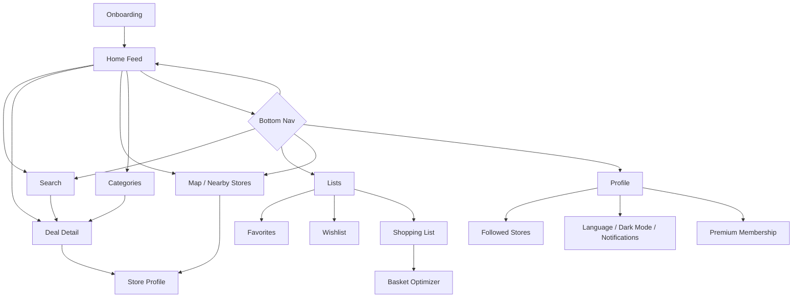
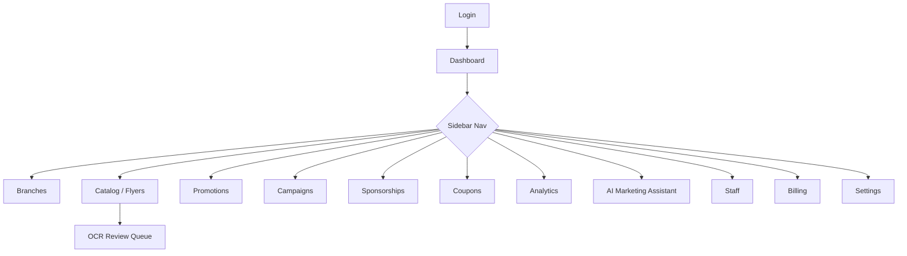

<Note>
**Phase 13** of the DealMarket Cameroon build roadmap. These are **low-fidelity wireframes** — layout and information hierarchy only, no color, type, or component styling. Visual design (the actual look-and-feel implementing the "Apple/Airbnb/Uber-inspired premium" bar from the [Product Requirements Document §10](/product/requirements)) is defined as a reusable system in Phase 14, then applied to these layouts. Every screen below is traceable to a functional requirement and grounded in a [Phase 5 persona](/product/user-personas)'s golden path.
</Note>

## 1. Wireframe Conventions

- `[ Button ]` = tappable/clickable action. `( )` = input field. `[img]` = image placeholder. `≡` = menu/hamburger. `‹ ›` = navigation chevrons.
- Layouts are drawn mobile-first for the consumer app (single column, bottom nav) and desktop-first for the retailer portal (sidebar nav), matching how each persona actually holds a phone vs. sits at a browser.
- Wireframes show the **default/happy-path state only**; loading, empty, and error states are specified separately in §9 rather than duplicated per screen, per NFR-UX-003.

---

## 2. Consumer App — Information Architecture



Five-tab bottom navigation (Home, Search, Lists, Map, Profile) — chosen over a deeper hierarchy because every consumer persona's core loop (Amina, Junior, Paul, Marie — Phase 5) reaches its primary action within one tap from the tab bar, satisfying NFR-UX-001's 3-tap budget with room to spare.

---

## 3. Consumer App — Key Flows

<AccordionGroup>
  <Accordion title="Onboarding → First Deal (Amina, Junior)">
    ```mermaid
    flowchart LR
        Launch[App Launch] --> Lang[Select Language<br/>FR/EN]
        Lang --> LocPerm[Location Permission<br/>prompt + explanation]
        LocPerm -->|granted| Home[Home Feed<br/>ranked by distance]
        LocPerm -->|denied| HomeNoLoc[Home Feed<br/>ranked by popularity/discount]
        Home --> DealTap[Tap a deal card]
        DealTap --> DealDetail[Deal Detail screen]
    ```
    Maps to FR-UX-004 (guided onboarding). Denying location must not dead-end the app — it degrades ranking gracefully, mirroring the Smart Ranking cold-start behavior from AI Architecture §5.
  </Accordion>
  <Accordion title="Search & Compare (Junior, Paul)">
    ```mermaid
    flowchart LR
        Search[Search tab] --> Query[Type query]
        Query --> Results[Result list<br/>sort/filter controls]
        Results --> Compare[Select 2+ products<br/>→ Compare view]
        Compare --> StoreCompare[Compare stores<br/>for chosen product]
    ```
    Maps to FR-DISC-004, FR-DISC-009, FR-DISC-010.
  </Accordion>
  <Accordion title="Shopping List → Basket Optimization (Marie)">
    ```mermaid
    flowchart LR
        List[Shopping List] --> AddItems[Add items<br/>free text or product search]
        AddItems --> Optimize[Tap 'Optimize My Trip']
        Optimize --> Plan[Optimized plan:<br/>store(s), items per store, total savings]
        Plan --> Directions[Get directions<br/>to each store]
    ```
    Maps to FR-PERS-003, FR-PERS-005, FR-LOC-002.
  </Accordion>
  <Accordion title="Follow Store → Geo-Targeted Alert (Paul)">
    ```mermaid
    flowchart LR
        StoreProfile[Store Profile] --> Follow[Tap 'Follow']
        Follow --> Prefs[Notification preferences<br/>confirmation]
        Prefs --> LaterVisit[Later: consumer near store]
        LaterVisit --> PushAlert[Geo-targeted push:<br/>active promotion nearby]
        PushAlert --> DealDetail[Deal Detail]
    ```
    Maps to FR-PERS-002, FR-LOC-004.
  </Accordion>
</AccordionGroup>

---

## 4. Consumer App — Screen Wireframes

### Home Feed

```text
┌─────────────────────────────────┐
│ ≡   DealMarket           🔔  🌙 │
├─────────────────────────────────┤
│ 📍 Douala, Akwa      [Change]   │
│ Sort: [Distance ▾] [Discount] [Price] │
├─────────────────────────────────┤
│ ⚡ Flash Deals ───────────────►  │
│ [img][img][img][img]            │
├─────────────────────────────────┤
│ 🏆 Deal of the Day               │
│ ┌───────────────────────────┐   │
│ │ [img]  Product Name        │   │
│ │        1,200 XAF  ~~2,000~~│   │
│ │        -40% · 2.1km · ⏱ 6h │   │
│ └───────────────────────────┘   │
├─────────────────────────────────┤
│ Nearby Deals                     │
│ ┌─────────────┐ ┌─────────────┐ │
│ │ [img]        │ │ [img] Spon. │ │
│ │ Product · -20%│ │ Product ·-15%│ │
│ │ 1.4km         │ │ 0.9km        │ │
│ └─────────────┘ └─────────────┘ │
├─────────────────────────────────┤
│  [Home] [Search] [Lists] [Map] [Profile] │
└─────────────────────────────────┘
```

Satisfies FR-DISC-001–003, FR-DISC-006–007. The sponsored card carries a visible "Spon." label per FR-DISC-003 — sponsorship is never visually indistinguishable from organic results.

### Deal Detail

```text
┌─────────────────────────────────┐
│ ‹ Back                    ⋮ Share│
├─────────────────────────────────┤
│         [ Product Image ]        │
├─────────────────────────────────┤
│ Product Name · Brand             │
│ 1kg · Family Pack                │
│                                   │
│ 1,200 XAF   ~~2,000 XAF~~  -40%  │
│ ⏱ Expires in 6h 12m              │
├─────────────────────────────────┤
│ 🏬 Store Name · 2.1km   [Directions]│
│ Valid: Aug 1 – Aug 5              │
├─────────────────────────────────┤
│ 📈 Price History          [chart]│
├─────────────────────────────────┤
│ [ ♡ Favorite ] [ ★ Wishlist ]    │
│ [ + Add to Shopping List ]       │
│ Share: [WhatsApp][FB][IG][TikTok]│
└─────────────────────────────────┘
```

Satisfies FR-DISC-006, FR-DISC-008, FR-PERS-001, FR-PERS-003, FR-NOTIF-002.

### Store Profile / Map

```text
┌─────────────────────────────────┐
│ ‹ Back                            │
├─────────────────────────────────┤
│         [ Map with pin ]         │
├─────────────────────────────────┤
│ Store Name              [Follow] │
│ ⭐ 4.3 · 128 followers            │
│ 🕐 Open now · Closes 9:00 PM      │
│ 📍 Address line          [Directions]│
├─────────────────────────────────┤
│ Active Promotions (24)            │
│ [card][card][card] ──────────►   │
└─────────────────────────────────┘
```

Satisfies FR-LOC-001–003, FR-PERS-002.

### Shopping List / Basket Optimizer Result

```text
┌─────────────────────────────────┐
│ ‹ My Shopping List      [+ Add]  │
├─────────────────────────────────┤
│ ☐ Rice 5kg                       │
│ ☐ Cooking oil 1L                 │
│ ☑ Sugar 1kg                      │
├─────────────────────────────────┤
│         [ Optimize My Trip ]     │
├─────────────────────────────────┤
│ Optimized Plan · Save 3,400 XAF  │
│ ┌───────────────────────────┐   │
│ │ Stop 1: Store A (1.2km)    │   │
│ │  - Rice 5kg, Sugar 1kg      │   │
│ │ Stop 2: Store B (2.0km)     │   │
│ │  - Cooking oil 1L           │   │
│ └───────────────────────────┘   │
│         [ Get Directions ]       │
└─────────────────────────────────┘
```

Satisfies FR-PERS-003, FR-PERS-005.

---

## 5. Retailer Portal — Information Architecture



---

## 6. Retailer Portal — Key Flows

<AccordionGroup>
  <Accordion title="Flyer Upload → Publish (Chief Ngozi, Brice)">
    ```mermaid
    flowchart LR
        Catalog[Catalog page] --> Upload[Upload flyer<br/>PDF/image]
        Upload --> Processing[Processing indicator<br/>up to 5 min]
        Processing --> Queue[OCR Review Queue]
        Queue --> ReviewItem[Open extracted item:<br/>confidence-flagged fields]
        ReviewItem --> Correct[Correct / confirm fields]
        Correct --> Approve[Approve]
        Approve --> Live[Promotion goes live]
    ```
    Maps to FR-CAT-002, FR-OCR-001–004. This is the single most important flow in the retailer portal — it's Chief Ngozi's entire onboarding experience (Phase 5, Phase 4 §4.1).
  </Accordion>
  <Accordion title="Campaign Scheduling & Sponsorship (Estelle)">
    ```mermaid
    flowchart LR
        Campaigns[Campaigns page] --> New[New Campaign]
        New --> SelectPromos[Select promotions/branches]
        SelectPromos --> Schedule[Set schedule + duration]
        Schedule --> Sponsor{Add sponsorship?}
        Sponsor -->|yes| CheckAvail[Check placement availability]
        CheckAvail --> Purchase[Purchase placement]
        Sponsor -->|no| Publish
        Purchase --> Publish[Publish campaign]
    ```
    Maps to FR-CAT-004, FR-MON-001–004.
  </Accordion>
  <Accordion title="Seasonal Recommendation → Accepted Campaign (Estelle)">
    ```mermaid
    flowchart LR
        Dash[Dashboard] --> Rec[AI recommendation banner:<br/>'Back-to-School starts in 3 weeks']
        Rec --> Detail[View recommendation:<br/>products, copy, budget, timing]
        Detail -->|Accept| Prefill[Pre-fills draft campaign]
        Detail -->|Dismiss| Logged[Dismissed, logged]
        Prefill --> Edit[Edit & schedule<br/>as normal campaign]
    ```
    Maps to FR-BI-004–005.
  </Accordion>
</AccordionGroup>

---

## 7. Retailer Portal — Screen Wireframes

### Dashboard

```text
┌────────┬──────────────────────────────────────────┐
│ ≡ Logo │  Dashboard                    [Branch ▾]  │
│        ├──────────────────────────────────────────┤
│ Dash   │  ⚠ 3 items pending OCR review   [Review]  │
│ Branches│ ──────────────────────────────────────── │
│ Catalog│  Views      Clicks     Favorites   ROI    │
│ Promos │  12,400     3,100      480         2.1x   │
│ Campaigns│ ──────────────────────────────────────── │
│ Sponsor│  📈 Weekly Trend           [chart]         │
│ Coupons│ ──────────────────────────────────────── │
│ Analytics│ 💡 AI Recommendation                     │
│ Marketing│  "Ramadan starts in 4 weeks —            │
│ Staff   │   suggested campaign ready"  [View]      │
│ Billing │ ──────────────────────────────────────── │
│ Settings│  Top Performing Categories  [list]        │
└────────┴──────────────────────────────────────────┘
```

Satisfies FR-DASH-001–004, FR-BI-004. Pending OCR reviews surface as a dashboard alert, not buried in a submenu — reinforcing that review is a blocking, time-sensitive task (Brice/Chief Ngozi's daily loop).

### OCR Review Queue

```text
┌────────┬──────────────────────────────────────────┐
│ Sidebar│  OCR Review Queue          12 pending      │
│        ├──────────────────────────────────────────┤
│        │ ┌────────────────────────────────────┐   │
│        │ │ [img]  Extracted: "Riz Blanc 5kg"    │   │
│        │ │ Price: 3,500 → 2,900  (confidence: ✅)│   │
│        │ │ Dates: Aug 1–5         (confidence: ⚠)│   │
│        │ │ Category: Grains       (confidence: ✅)│   │
│        │ │                                       │   │
│        │ │ [ Edit Fields ] [ Reject ] [ Approve ]│   │
│        │ └────────────────────────────────────┘   │
│        │ ┌────────────────────────────────────┐   │
│        │ │ ... next item ...                     │   │
└────────┴──────────────────────────────────────────┘
```

Satisfies FR-OCR-003–004. Low-confidence fields (⚠) are visually distinguished so staff attention goes there first, per AI Architecture §3.

### Analytics Dashboard (expanded)

```text
┌────────┬──────────────────────────────────────────┐
│ Sidebar│  Analytics              [Period: 30d ▾] [Export]│
│        ├──────────────────────────────────────────┤
│        │ Promotion Health Score: 78/100  [details] │
│        │ ──────────────────────────────────────── │
│        │ Views/Clicks/Shares/Favorites  [chart]    │
│        │ ──────────────────────────────────────── │
│        │ Top Products      Top Categories           │
│        │ [table]           [table]                  │
│        │ ──────────────────────────────────────── │
│        │ Seasonal Forecast   [chart]                │
└────────┴──────────────────────────────────────────┘
```

Satisfies FR-DASH-001–005.

---

## 8. Platform Admin — Screen Wireframes (Brief)

```text
┌────────┬──────────────────────────────────────────┐
│ Admin  │  Retailer Approval Queue     8 pending    │
│ Sidebar├──────────────────────────────────────────┤
│        │ [Retailer Name] [Type] [Submitted] [Review]│
│        │ [Retailer Name] [Type] [Submitted] [Review]│
├────────┴──────────────────────────────────────────┤
│ Moderation Queue                                     │
│ [Flagged Item] [Reason] [Reported] [Resolve]         │
└──────────────────────────────────────────────────────┘
```

Satisfies FR-ADMIN-001–002. Kept intentionally minimal — Sandrine's persona (Phase 5) needs an efficient queue, not a rich dashboard.

---

## 9. Cross-Cutting UX States

Per NFR-UX-003, every screen above needs these states defined once, applied everywhere:

| State | Pattern |
|---|---|
| **Loading** | Skeleton placeholders matching the eventual layout (card-shaped grey blocks), never a blank screen or full-page spinner for feed/list screens. |
| **Empty** | Contextual message + a clear next action (e.g., empty Favorites: "No favorites yet — browse deals" with a button back to Home), never a bare "No data." |
| **Error** | Inline retry affordance for recoverable errors (network); full-screen error state only for unrecoverable cases, always with a way back. |
| **Offline** | Cached content renders with a persistent "offline / showing saved deals" banner, per FR-UX-003 — never a hard failure. |
| **Dark mode** | Every wireframe above has a dark-mode equivalent using the same layout — dark mode is a theme swap on the Phase 14 component library, not a separate design. |

---

## Next Phase

Phase 14: **Component Library** — the reusable design system (tokens, components) that gives these wireframes their actual visual identity, implementing the "premium, Apple/Airbnb/Uber-inspired" bar from the PRD. Awaiting approval to proceed.
